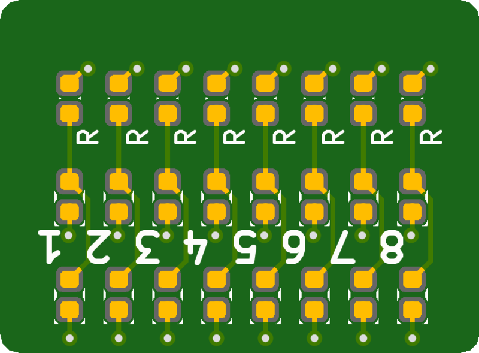
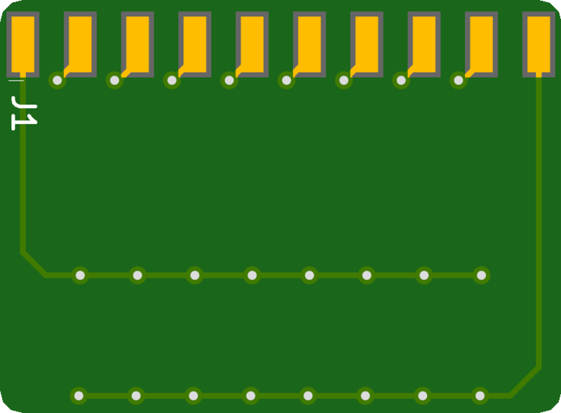

# BiLEDOctalBoard

## About This Project

# Octal LED board (bi-directional)

I just saw a nice project on [Hackaday](https://hackaday.com/2018/09/08/see-binary-on-your-breadboard/) which provides a common anode or cathode 8 LED display for breadboarding. Since it is horizontally mounted bridging over two breadboards (which I find a quite weird layout but okay) it takes a lot of space while providing rather little functionality. So I came up with my own board which mounts vertically offers space for 8 or 16 LEDs (your choice) in antiparallel configuration (technically you could also use this for multiplexing 2x8 LEDs) which means that if you connect hook up ground to one end and Vcc to the other end (which depends on the direction the LEDs are mounted so I didn&#39;t silkscreen any) either the upper or the lower LED (or none if the according pin is floating) will light up so.

## Renderings

### Top

### Bottom

## BOM

|Count|Component|Details|Datasheet|
|-|-|-|-|
|x||||

---

This project is managed and available on

You can view it [here](https://aisler.net/p/RDFTEKUD). Start your own Powerful Prototype on [here](https://aisler.net).
